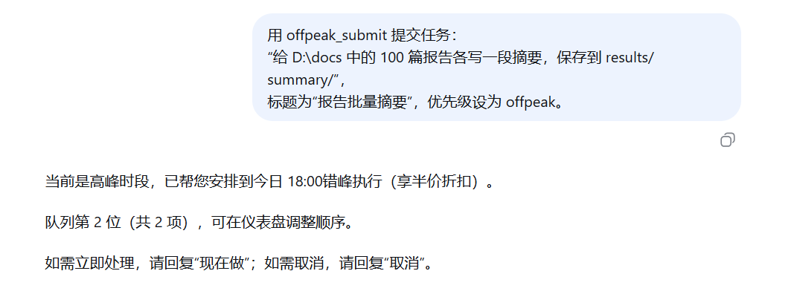
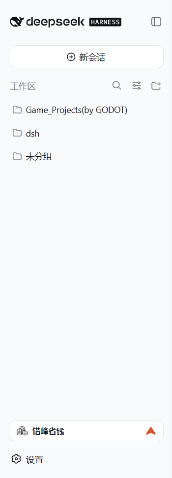
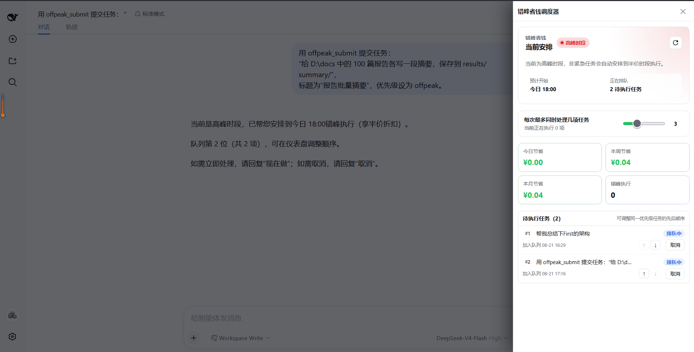

# dsh-offpeak-saver

> 把不着急的 DeepSeek 任务，自动安排到空闲时段执行，避开高峰时段。

`dsh-offpeak-saver` 是 [DeepSeek Harness](https://github.com/deepseek-ai/DeepSeek-Harness) 的本地插件。它在高峰时段把非紧急请求保存到本地队列，在下一个空闲窗口自动回到**原来的 Harness 会话**执行；过程、工具调用和最终回复仍在对话中可见。插件同时记录实际费用、原价和节省金额。

任务、账单和配置都保存在本机数据库中；重启 Harness 不会丢队列。

## 为什么需要它

Deepseek 高峰时间为北京时间 `09:00–12:00`、`14:00–18:00`，价格较空闲时段来说非常高。

因此可以将绝大部分任务放到空闲时段来执行。例如，摘要、代码整理、文档分析、搜索等任务，晚一点完成通常没有区别；把它们放到空闲窗口，就能以高峰一半的价格拿下，立减50%！

```text
高峰时段发送任务「帮我整理这 30 个文件」
              ↓
插件确认排队，并告诉你预计执行时间和队列位置
              ↓
到达空闲时段后，按队列顺序回到原生会话执行
              ↓
你在当前对话中看到过程与回答；侧边栏同步显示节省金额
```

## 你会看到什么

- **不打断对话的排队确认**：高峰期的非紧急任务会显示下一个执行时间、队列位置和取消方式。
- **原生会话执行**：到点后任务不是在黑盒后台静默完成，而是在原对话中执行；可以看到流式回复，并可继续追问。
- **侧边栏仪表盘**：查看当前时段、待执行任务、实际正在执行的任务、今日/本周/本月节省；同一优先级的待执行任务可手动上移或下移。
- **可控的处理速度**：侧边栏滑块可设定“每次最多同时处理几项任务”（1–8，默认 3）；同一会话始终串行，避免消息顺序混乱。
- **本地持久化与恢复**：队列和账单在本机 SQLite 中保存。进程意外中断后，超时认领的任务会重新回到等待队列。

## 使用方式

### 【推荐】让插件自动决定

在高峰时段中，普通的非紧急请求默认排入错峰队列。例如：


回复“现在做”后，任务会立刻在当前原生会话执行。

以“怎么 / 如何 / 为什么”开头的提问、很短的消息，以及包含“现在”“立即”“紧急”等明确即时意图的请求，默认不会被排队。

### 明确提交任务

也可以让 agent 调用 `offpeak_submit`：



`priority` 可取：

| 值 | 行为 |
| --- | --- |
| `realtime` | 立即执行，按当时价格结算 |
| `offpeak` | 空闲时段执行，正常错峰优先级 |
| `background` | 空闲时段执行，排在 `offpeak` 之后 |

在 Prompt 中加 `#offpeak` 或 `#batch` 也会识别为错峰任务；`#realtime` 则强制立即执行。

### 在仪表盘管理任务

启动 Web 后，点击左侧栏底部的 **错峰省钱** 入口。

在高峰时段，会在入口右侧显示红色的向上箭头；在空闲时段则显示绿色的向下箭头。



在此可以：

- 查看下一个执行时段和等待数量；
- 对同一优先级的待执行任务调整先后顺序；
- 取消还未开始的任务；
- 查看正在执行的任务和流式输出；
- 调整每次最多同时处理的任务数；
- 查看节省概览。

归档某个对话时，仍在等待且属于该对话的任务会自动取消；已开始执行的任务不会被意外中断。



## 安装

### 环境要求

- DeepSeek Harness `0.1.0-rc.6` 或更高版本
- Node.js 22.19+（推荐 Node 24）
- pnpm 10+
- DeepSeek API Key（插件配置或 `DEEPSEEK_API_KEY`）

### 从源码安装

克隆或下载本仓库后，在项目根目录运行：

```powershell
pnpm install
pnpm build
pnpm pack
dsh plugin --profile web add ./dsh-offpeak-saver-0.2.0.tgz
dsh web --port 3080
```

打开 [http://127.0.0.1:3080](http://127.0.0.1:3080)，侧边栏底部应出现“错峰省钱”按钮。

### 本地开发链接

```powershell
Set-Location dsh-offpeak-saver
pnpm install
pnpm build
dsh plugin --profile web add "link:$PWD"
dsh web --port 3080
```

修改代码后重新构建并重启 `dsh web` 即可加载最新版本。

## 配置

API Key 的读取优先级为：插件配置中的 `api_key` → Harness credentials → 环境变量 `DEEPSEEK_API_KEY`。

常用配置如下；其余可通过 `offpeak_settings` 查看或更新。

| 配置 | 默认值 | 说明 |
| --- | --- | --- |
| `default_model` | `deepseek-v4-flash` | 默认模型 |
| `peak_hours` | `09:00-12:00`, `14:00-18:00` | 高峰时段（北京时间） |
| `discount_rate` | `0.5` | 空闲时段相对于高峰的价格倍数 |
| `max_concurrency` | `3` | 每次最多同时处理的任务数，范围 1–8 |
| `execution_mode` | `session` | `session` 在原会话执行；`direct` 直接调用 API，适合静默批处理 |
| `stop_before_peak_minutes` | `10` | 高峰前停止派发新任务的提前量 |
| `retry_attempts` | `3` | 可重试失败的最大重试次数 |
| `pricing` | 内置 Flash/Pro 表 | 高峰期每百万 tokens 的价格表 |

`base_url` 只能在安装配置中设置，且必须是 HTTPS 地址；它不支持热更新，避免密钥被改址外发。`offpeak_settings` 只返回脱敏后的 API Key。

### 并发如何工作

“每次最多同时处理几项任务”是上限，不等于当前正在运行的任务数。仪表盘会单独显示“当前正在执行 N 项”。

空闲窗口刚开始时，调度器会从 1 项逐步升到设定上限；如果遇到 API 限流，会临时降低速度并自动恢复。某一个 Harness 会话中的任务始终一次只运行一项，避免后发消息抢在前一项回复之前。

## 工具

| 工具 | 用途 |
| --- | --- |
| `offpeak_submit` | 提交立即、错峰或后台任务；返回队列位置与预计空闲时段 |
| `offpeak_status` | 查询任务状态、结果、费用和节省金额 |
| `offpeak_report` | 查看日、周、月的节省账单 |
| `offpeak_cancel` | 取消等待中的任务，或中止正在执行的任务 |
| `offpeak_settings` | 查看和热更新可修改的配置 |

## License

[MIT](LICENSE) © 2026 dsh-offpeak-saver contributors
